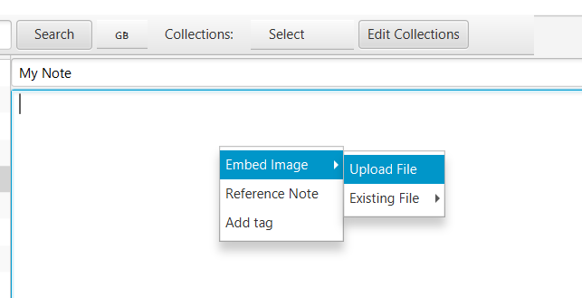

## Collections

## Tags

## Embedding images
You can embed images from your local computer. Right click on the note's text area to `Embed Image`

You can upload a file

Or choose an existing file that is saved in the note

Your image is now embedded
