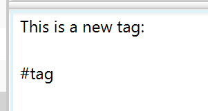
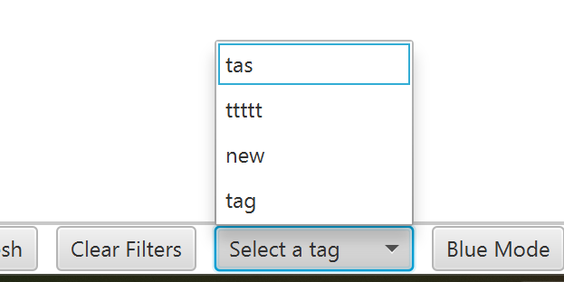
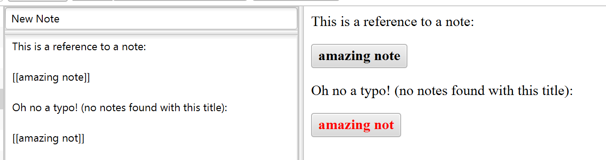

## Adding tags
You can create a new tag by typing ``#tagName`` in your note. The name can't include spaces.

## Filtering by tags
To filter by a tag, click on it in the rendered view. This will select all notes containing that tag.
You can do the same by selecting a tag using the `Select a tag` menu at the bottom. Make sure you refresh before, to see all available tags.

You can select multiple tags by repeating this process.
To clear the filters, click on the 'Clear Filters' button next to the menu.

## Referencing notes
You can reference another note by typing ``[[NoteTitle]]`` in your note. It has to be the exact title, if the note is not found, the preview will be displayed using a red color.

## Changing the theme
To change the theme of the app to blue, click on the Blue Theme button in the bottom right corner

## Changing the language
To change the language of the application, click on the drop-down menu (next to the Search button) and select a language.
You can choose between English, Dutch, Spanish, Polish and Romanian.

## Embedding images
You can embed images from your local computer. Right-click on the note's text area to `Embed Image`

You can upload a file

Or choose an existing file that is saved in the note

Your image is now embedded

## Managing embedded images
It's possible to view the list of embedded files, rename and delete them.
You can alter embedded files by right-clicking on them in the list.

Renaming a file will rename all of its references in the current note.

## Downloading embedded images
Downloading images is very straight forward, you may click on an image in the markdown preview to save it to your computer.

