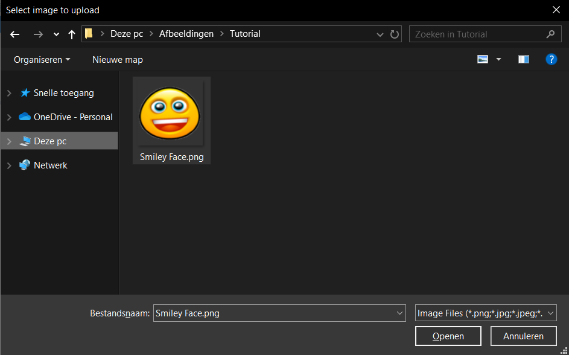
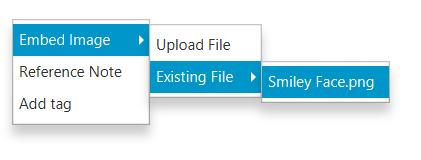
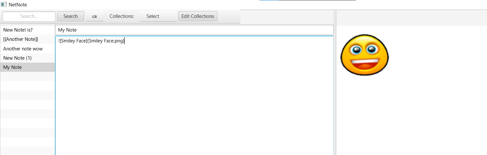
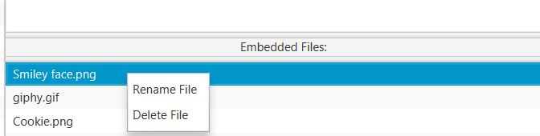

## Collections

## Tags

## Embedding images
You can embed images from your local computer. Right click on the note's text area to `Embed Image`

You can upload a file

Or choose an existing file that is saved in the note

Your image is now embedded

## Managing embedded images
It's possible to view the list of embedded files, rename and delete them.
You can alter embedded files by right clicking on them in the list.

Renaming a file will rename all of its references in the current note.